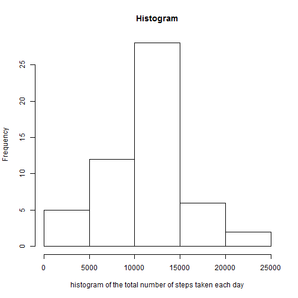
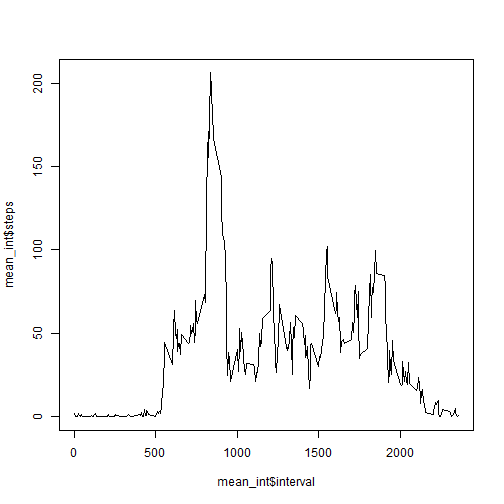
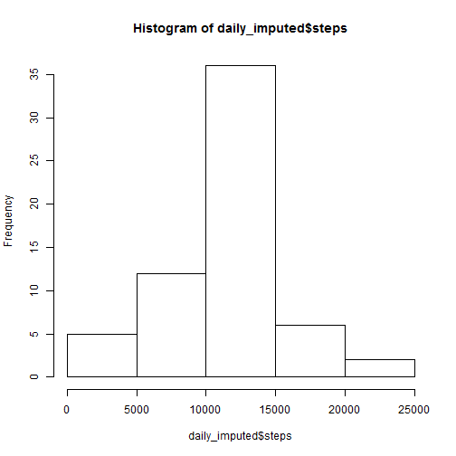
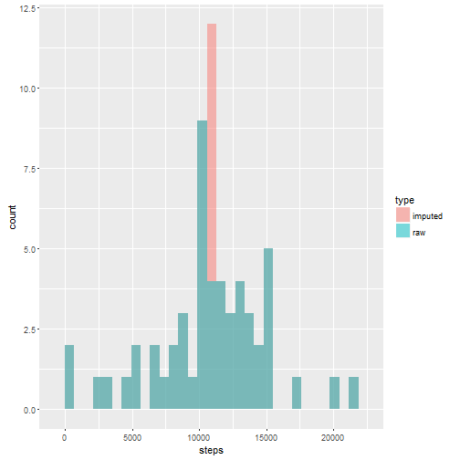
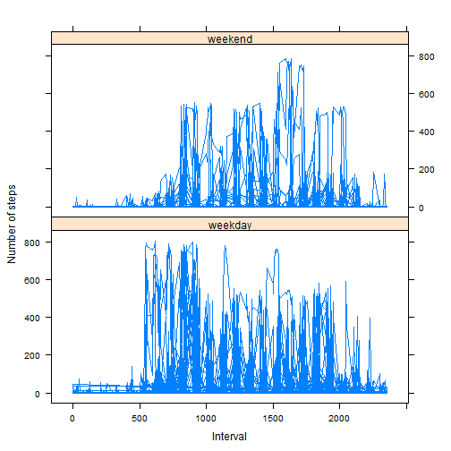

Assignment 1
==========================

####First we need to load the data and format it

```r
download.file("http://d396qusza40orc.cloudfront.net/repdata%2Fdata%2Factivity.zip", 
              "data.zip", quiet = TRUE, mode = "wb")  
unzip("data.zip")
raw_activity <- read.csv("activity.csv", stringsAsFactors=FALSE)
activity <- raw_activity[!is.na(raw_activity$steps),]
```
#Mean total number of steps taken per day
####Calculate mean total number of steps taken per day

```r
mtn_steps = aggregate(activity$steps, by = list(Date = activity$date), FUN =sum)
```

####Create Histogram

```r
names(mtn_steps)[2] = "steps"
hist(mtn_steps$steps, xlab="histogram of the total number of steps taken each day", main="Histogram")
```

 

####calculate and report mean and median

```r
print(c("Mean", mean(mtn_steps$steps)))
```

```
## [1] "Mean"             "10766.1886792453"
```

```r
print(c("Median", median(mtn_steps$steps)))
```

```
## [1] "Median" "10765"
```

#Find the average daily activity pattern

```r
mean_int <-aggregate(activity$steps, by = list(interval=activity$interval), FUN =mean)
names(mean_int)[2] <-"steps"
plot(mean_int$interval, mean_int$steps,type="l")
```

 

#Imputing missing values

```r
max_num_of_steps <-mean_int$steps == max(mean_int$steps)
which(max_num_of_steps)
```

```
## [1] 104
```

```r
mean_int[which(max_num_of_steps),]
```

```
##     interval    steps
## 104      835 206.1698
```

```r
na_activity <- raw_activity[is.na(raw_activity$steps),]
nrow(na_activity)
```

```
## [1] 2304
```


####Create a new dataset that is equal to the original dataset but with the missing data filled in

```r
na_imputed_activity<- raw_activity
na_act_length <- nrow(na_imputed_activity)

for (i in 1:na_act_length)
{
  if (is.na(na_imputed_activity[i,1]) )
  {
    to_impute <- subset(raw_activity, raw_activity$interval == na_imputed_activity[i,3], select = c(steps,interval) )
    na_imputed_activity[i,1] <- mean(to_impute$steps, na.rm = TRUE)
  }
}
```
####Make a histogram of the total number of steps taken each day

```r
daily_imputed <-aggregate(na_imputed_activity$steps, by = list(Date=na_imputed_activity$date), FUN =sum)
names(daily_imputed)[2] <-"steps"
hist(daily_imputed$steps)
```

 

```r
#Calculate and report the mean and median total number of steps taken per day
new_mean = mean(daily_imputed$steps)
new_median = median(daily_imputed$steps)
```

####Do these values differ from the estimates from the first part of the assignment

```r
old_mean <- mean(mtn_steps$steps)
old_median <- median(mtn_steps$steps)
#difference in mean
new_mean - old_mean
```

```
## [1] 0
```

```r
new_median - old_median
```

```
## [1] 1.188679
```

####Impact of imputing missing data on the estimates of the total daily number of steps. Create hist

```r
library(ggplot2)
mtn_steps$type <-'raw'
daily_imputed$type <- 'imputed'
combined <- rbind(mtn_steps, daily_imputed)
ggplot(combined, aes(steps, fill = type)) + 
  geom_histogram(alpha = 0.5,  position = 'identity')
```

```
## `stat_bin()` using `bins = 30`. Pick better value with `binwidth`.
```

 

#Differences in activity patterns between weekdays and weekends?

####Create a new factor variable in the dataset with two levels - "weekday" and "weekend"

```r
weekday <- weekdays(as.Date(na_imputed_activity$date, "%Y-%m-%d"))
head(weekday)
```

```
## [1] "Monday" "Monday" "Monday" "Monday" "Monday" "Monday"
```

```r
for (i in 1:length(weekday)) {
  if ((weekday[i] == "Saturday") | (weekday[i] == "Sunday")) 
    weekday[i] = "weekend" else weekday[i] = "weekday"
}
na_imputed_activity$weekday <- as.factor(weekday)
LevelmeanInterval<-aggregate(na_imputed_activity$steps, by = list(interval=na_imputed_activity$interval, level=na_imputed_activity$weekday), FUN =mean)
```

####Make a panel plot containing a time series plot

```r
names(LevelmeanInterval)[3] <-"steps"
library(lattice)
xyplot(steps ~ interval | weekday, data = na_imputed_activity, layout = c(1, 2), type="l", 
       ylab = "Number of steps", xlab="Interval" )
```

 
knit2html()
